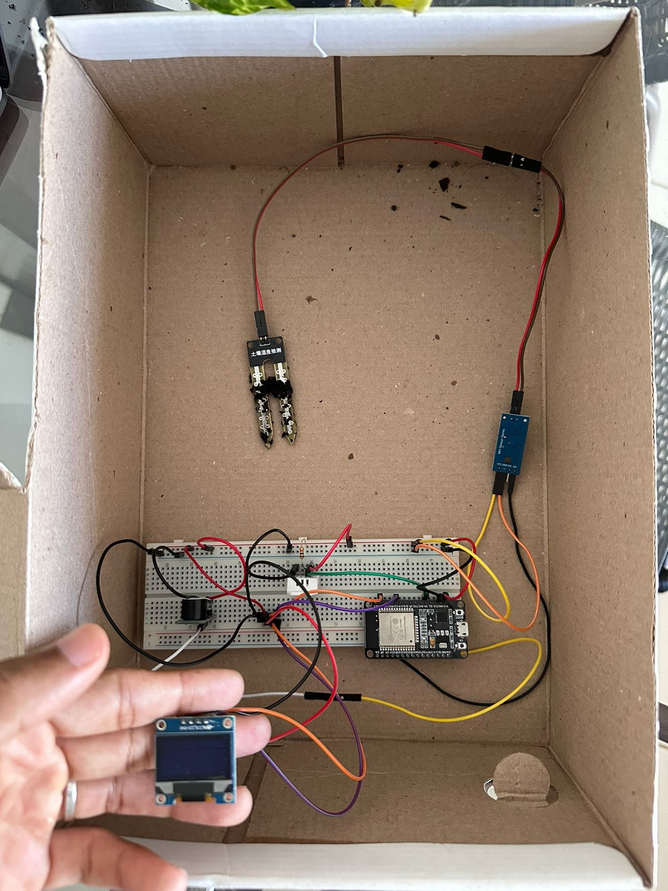
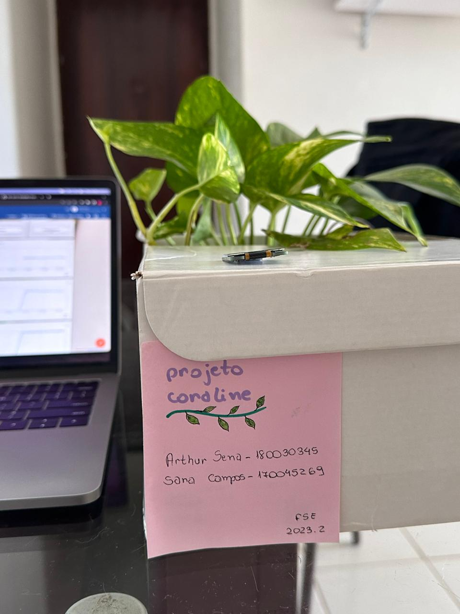
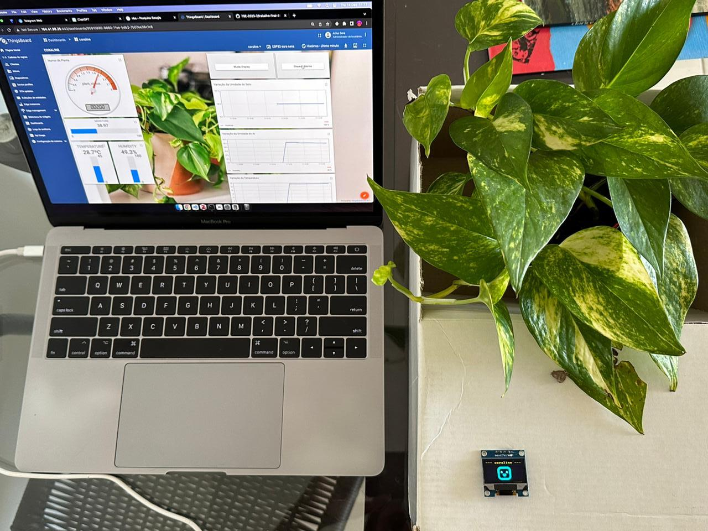
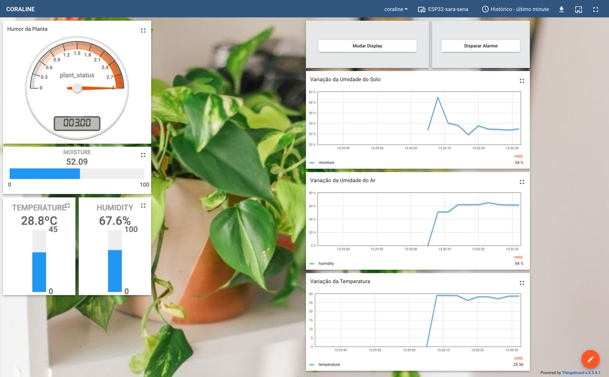
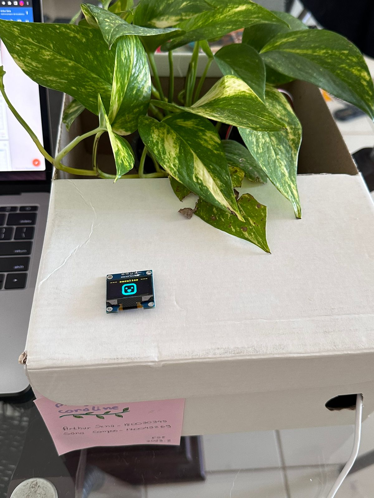

# Projeto Coraline 

Este projeto é um Tamagochi chamado **Coraline** que ajuda a cuidar de uma plantinha monitorando as condições de temperatura do ar, umidade do ar e a umidade do solo. A Coraline recebe esses estados através de sensores que serão especificados a seguir, e informa seu humor (radiante, feliz, triste ou com sede) ao usuário através de um emoji indicativo de como ela está e um alarme que anuncia que a planta precisa ser regada. 

## Componentes 

Servidor Central - Dashboard Thingsboard, Cliente ESP32 distribuído e as seguintes entradas e saídas  associadas: 

| Entradas | 
| - | 
| Botão (Presente na placa)|
| Sensor de Temperatura e Umidade do Ar DHT22 |
| Sensor Resistivo de Umidade de Solo | 

| Saídas | 
| - | 
| LED (Presente na placa) |
| OLED SSD1306 |
| Buzzer |

## Funcionalidades

O módulo OLED SSD1306 tem duas opções de visualização: humor ou informações. As informações apresentadas são as leituras de temperatura do ar, umidade do ar e umidade do solo. O humor da planta é representado por emojis, tendo quatro opções possíveis:
- Radiante: a planta está em condições ideais, ou seja, temperatura do ar entre 18ºC e 33ºC, umidade do ar maior que 50% e umidade do solo de 40% para mais; 
- Feliz: a planta está em boas condições de temperatura do ar e umidade do ar e do solo, apesar de não atingir métricas excelentes;
- Triste: a planta está incomodada com algo, seja temperatura fora do intervalo de 18ºC a 32ºC, ou umidade do ar abaixo do ideal, ou pouca umidade do solo;
- Sede: a planta está com solo seco apresentando 25% ou menos de umidade. Neste estado a planta também dispara  um alarme via buzzer para sinalizar que precisa ser regada. 

A partir do uso do Servidor Central Thingsboard foi criado o Dashboard para visualizar em tempo real o humor da planta e todas as leituras dos sensores (telemetria e estado dos atributos), que são enviadas via MQTT. Além disso, o Dashboard apresenta gráficos com a variação dessas leituras ao longo do tempo e permite disparar comandos RPC para acionar o alarme caso a planta sinta sede ou mudar a visualização do display OLED, mostrando humor ou informações. 

Todos os estados dos atributos são armazenados na memória NVS, de modo que ao ser reinicializada, a placa volta exatamente para o estado onde estava.

## Pinout

Na imagem a seguir é possível observar como os módulos foram conectados a placa ESP32. 

## Em execução 

### Coraline
 

### Dashboard

### Display 

---
## Fundamentos de Sistemas Embarcados 2023.2

| Estudante | Matrícula | 
| - | - |
| Arthur Sena | 180030345 | 
| Sara Campos | 170045269 | 
